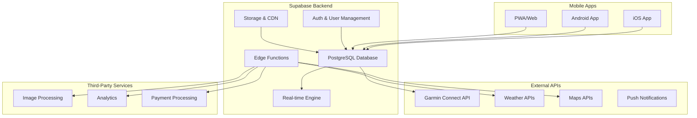
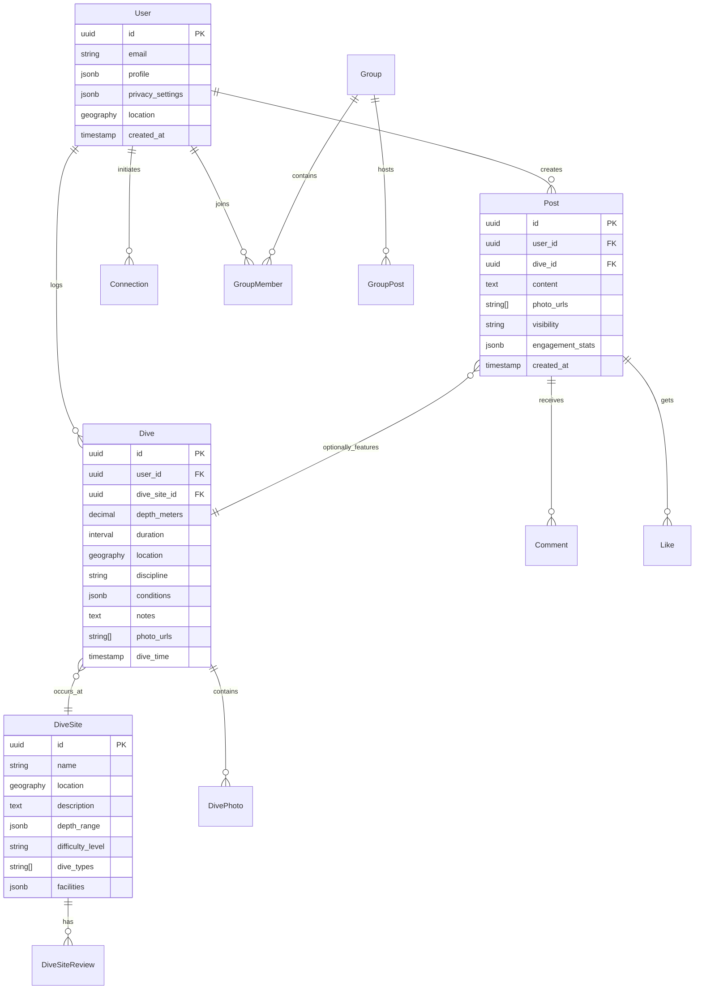

# DiveTribe Fullstack Architecture Document

## Introduction

This document outlines the complete fullstack architecture for **DiveTribe**, including backend systems, frontend implementation, and their integration. It serves as the single source of truth for AI-driven development, ensuring consistency across the entire technology stack.

This unified approach combines what would traditionally be separate backend and frontend architecture documents, streamlining the development process for modern fullstack applications where these concerns are increasingly intertwined.

DiveTribe is a mobile-first social platform for freedivers and spearfishers that combines performance tracking with community building - essentially "Strava for the ocean." The architecture must support real-time dive data synchronization, social features, and scalable growth across multiple geographic markets.

### Change Log

| Date           | Version | Description                             | Author          |
| -------------- | ------- | --------------------------------------- | --------------- |
| [Current Date] | 1.0     | Initial fullstack architecture creation | Architect Agent |

## Starter Template or Existing Project

**N/A - Greenfield Project**

Based on the PRD technical assumptions indicating React Native + Supabase preference, this is a greenfield mobile application. We will use Expo + Supabase as our foundation for rapid development and deployment across iOS and Android platforms.

**Recommended Starter:** Expo Router + Supabase starter template provides:

- Pre-configured authentication flows
- Database schema setup
- Real-time subscriptions
- File storage integration
- Push notifications setup

## High Level Architecture

### System Overview

DiveTribe follows a **mobile-first serverless architecture** with Supabase as the backend-as-a-service platform and React Native (Expo) for cross-platform mobile development.



### Architectural and Design Patterns

- **Backend-as-a-Service (BaaS):** Supabase provides managed PostgreSQL, authentication, real-time subscriptions, and storage - _Rationale:_ Reduces infrastructure complexity and enables rapid MVP development while maintaining scalability
- **Mobile-First Progressive Web App:** React Native with Expo Router for native performance and web compatibility - _Rationale:_ Maximizes reach with single codebase while optimizing for mobile experience
- **Event-Driven Real-time Architecture:** Supabase real-time subscriptions for live feed updates and notifications - _Rationale:_ Essential for social features and real-time dive tracking
- **Repository Pattern:** Abstract data access through typed services - _Rationale:_ Enables testing, caching strategies, and potential future database migrations
- **Component-Based UI Architecture:** Reusable components with design system - _Rationale:_ Ensures consistency across screens and accelerates development

## Tech Stack

### Cloud Infrastructure

- **Provider:** Supabase (built on AWS)
- **Key Services:** PostgreSQL, Real-time Engine, Edge Functions, Storage, Auth
- **Deployment Regions:** Global CDN with primary regions in US West, Europe, Asia-Pacific

### Technology Stack Table

| Category                 | Technology             | Version | Purpose                            | Rationale                                                             |
| ------------------------ | ---------------------- | ------- | ---------------------------------- | --------------------------------------------------------------------- |
| **Frontend Language**    | TypeScript             | 5.3.3   | Primary development language       | Strong typing prevents runtime errors, excellent React Native support |
| **Mobile Framework**     | React Native           | 0.73.x  | Cross-platform mobile development  | Single codebase for iOS/Android, native performance                   |
| **Development Platform** | Expo                   | 50.x    | React Native development platform  | Managed workflow for simplified deployment and updates                |
| **UI Component Library** | Gluestack UI           | v2.x    | Universal component library        | Universal components, built-in accessibility, performance-optimized   |
| **Backend-as-a-Service** | Supabase               | Latest  | Database, auth, real-time, storage | Comprehensive BaaS reducing infrastructure complexity                 |
| **State Management**     | Zustand                | 4.4.x   | Lightweight state management       | Simple API, TypeScript support, no boilerplate                        |
| **Navigation**           | Expo Router            | 3.x     | File-based routing                 | Type-safe navigation, web compatibility                               |
| **Authentication**       | Supabase Auth          | Latest  | User authentication service        | OAuth providers, session management, RLS integration                  |
| **Database**             | PostgreSQL             | 15.x    | Primary database                   | Relational data, JSON support, full-text search                       |
| **Real-time**            | Supabase Realtime      | Latest  | Live data synchronization          | WebSocket-based real-time subscriptions                               |
| **File Storage**         | Supabase Storage       | Latest  | Media and file storage             | S3-compatible, CDN, image transformations                             |
| **Maps**                 | Expo MapView           | 11.x    | Native maps integration            | Platform-native maps with dive site marking                           |
| **HTTP Client**          | Supabase JS            | 2.x     | API client library                 | Auto-generated types, auth integration                                |
| **Form Handling**        | React Hook Form        | 7.48.x  | Form validation and management     | Performance-optimized, minimal re-renders                             |
| **Testing Framework**    | Jest + Testing Library | Latest  | Unit and integration testing       | React Native compatible testing tools                                 |
| **E2E Testing**          | Maestro                | Latest  | End-to-end testing                 | Mobile-specific E2E testing framework                                 |
| **Code Quality**         | ESLint + Prettier      | Latest  | Code formatting and linting        | Consistent code style and quality                                     |
| **Type Checking**        | TypeScript             | 5.3.x   | Static type checking               | Type safety, better IDE support                                       |
| **Build Tool**           | Expo EAS               | Latest  | Build and deployment service       | Cloud-based builds for app stores                                     |
| **Analytics**            | Expo Analytics         | Latest  | User behavior tracking             | Privacy-focused analytics integration                                 |
| **Push Notifications**   | Expo Notifications     | Latest  | Cross-platform notifications       | Community engagement and safety alerts                                |
| **Device APIs**          | Expo Modules           | Latest  | Native device functionality        | Camera, location, contacts integration                                |

## Data Models

### Core Business Entities

Based on the PRD requirements, DiveTribe's data model centers around diving activities, social interactions, and community building:

#### User

- **Purpose:** Central entity representing divers with profiles, preferences, and authentication
- **Key Attributes:** id, email, profile (name, bio, certifications, gear), privacy_settings, location, diving_goals
- **Relationships:** one-to-many with Dives, Posts, Connections; many-to-many with Groups

#### Dive

- **Purpose:** Core activity tracking entity storing dive performance and metadata
- **Key Attributes:** id, user_id, depth, duration, location (GPS), dive_site, discipline, temperature, visibility, equipment, notes, photos, created_at
- **Relationships:** belongs to User, belongs to DiveSite, has many DivePhotos
- **Data Types:** depth (decimal), duration (interval), location (geography), photos (array)

#### DiveSite

- **Purpose:** Shared database of diving locations with community-contributed information
- **Key Attributes:** id, name, location (GPS), description, depth_range, difficulty_level, dive_type, conditions, facilities
- **Relationships:** has many Dives, has many DiveSiteReviews

#### Post

- **Purpose:** Social feed content combining dive data with photos and commentary
- **Key Attributes:** id, user_id, dive_id (optional), content, photos, visibility, created_at, engagement_stats
- **Relationships:** belongs to User, optionally belongs to Dive, has many Comments and Likes

#### Connection

- **Purpose:** Relationship management between users (buddies, instructors, followers)
- **Key Attributes:** id, requester_id, addressee_id, connection_type, status, created_at
- **Relationships:** belongs to two Users
- **Types:** buddy, instructor_student, follower

#### Group

- **Purpose:** Local diving communities and interest-based organizations
- **Key Attributes:** id, name, description, location, group_type, privacy_level, member_count
- **Relationships:** has many GroupMembers, belongs to creator User

### Database Relationships



## API Architecture

### Backend Services Architecture

DiveTribe uses **Supabase Edge Functions** for custom business logic while leveraging built-in database, auth, and storage services:

#### Core API Services

**1. Authentication Service (Supabase Auth)**

- Email/password registration and login
- OAuth integration (Google, Apple)
- Session management and refresh tokens
- Row Level Security (RLS) policy enforcement

**2. Dive Management Service (Edge Function)**

- Dive logging with validation and enrichment
- Garmin Connect API integration for automatic sync
- Personal analytics calculation and caching
- Achievement detection and milestone tracking

**3. Social Feed Service (Edge Function)**

- Feed algorithm for personalized content
- Post creation with image processing
- Real-time engagement updates via Supabase Realtime
- Content moderation and safety checks

**4. Discovery Service (Edge Function)**

- Buddy matching algorithm based on preferences and location
- Instructor/service provider search and filtering
- Dive site recommendation engine
- Availability and compatibility scoring

**5. Community Service (Edge Function)**

- Group management and membership
- Challenge creation and leaderboard calculation
- Event coordination and attendance tracking
- Safety alert and communication systems

### API Design Patterns

#### RESTful Endpoints

**Authentication Flows:**

```typescript
POST /auth/signup - Create new user account
POST /auth/signin - Authenticate user
POST /auth/signout - Invalidate session
GET /auth/user - Get current user profile
```

**Dive Management:**

```typescript
POST /api/dives - Log new dive
GET /api/dives - Get user's dive history (paginated)
PUT /api/dives/{id} - Update dive details
DELETE /api/dives/{id} - Remove dive record
GET /api/analytics/personal - Get user analytics dashboard
```

**Social Features:**

```typescript
GET /api/feed - Get personalized feed (paginated)
POST /api/posts - Create new post
GET /api/posts/{id} - Get specific post with comments
POST /api/posts/{id}/like - Toggle like on post
POST /api/posts/{id}/comments - Add comment to post
```

#### Real-time Subscriptions

**Supabase Realtime Channels:**

```typescript
// Feed updates for followed users
supabase.channel('user_feed').on(
  'postgres_changes',
  {
    event: 'INSERT',
    schema: 'public',
    table: 'posts',
    filter: `user_id=in.(${followedUserIds})`,
  },
  handleNewPost
)

// Live challenge leaderboards
supabase.channel('challenge_updates').on(
  'postgres_changes',
  {
    event: 'UPDATE',
    schema: 'public',
    table: 'challenge_participants',
  },
  handleLeaderboardUpdate
)
```

### External API Integrations

#### Garmin Connect API

```typescript
interface GarminIntegration {
  authenticateUser(): Promise<GarminAuthToken>
  syncDiveData(userId: string): Promise<GarminDive[]>
  getActivityDetails(activityId: string): Promise<GarminActivity>
  setupWebhook(userId: string): Promise<WebhookConfig>
}
```

#### Maps & Location Services

```typescript
interface LocationServices {
  searchDiveSites(query: string, location: LatLng): Promise<DiveSite[]>
  reverseGeocode(location: LatLng): Promise<LocationInfo>
  calculateDistance(from: LatLng, to: LatLng): Promise<number>
  getWeatherConditions(location: LatLng): Promise<WeatherData>
}
```

## Authentication & Security

### Authentication Flow

DiveTribe implements **Supabase Auth** with multiple authentication providers and comprehensive security measures:

#### Authentication Providers

- **Email/Password:** Traditional signup with email verification
- **Google OAuth:** Streamlined social login
- **Apple OAuth:** Required for iOS App Store compliance
- **Anonymous Sessions:** Guest browsing with upgrade prompts

#### Session Management

```typescript
// Automatic token refresh
supabase.auth.onAuthStateChange((event, session) => {
  if (event === 'SIGNED_IN') {
    // Store session and update app state
    AuthStore.setSession(session)
  }
  if (event === 'TOKEN_REFRESHED') {
    // Update stored session
    AuthStore.updateSession(session)
  }
})

// Row Level Security policies
CREATE POLICY "Users can only see their own dives" ON dives
FOR SELECT USING (auth.uid() = user_id);

CREATE POLICY "Users can view public posts" ON posts
FOR SELECT USING (
  visibility = 'public' OR
  user_id = auth.uid() OR
  user_id IN (SELECT addressee_id FROM connections WHERE requester_id = auth.uid())
);
```

### Data Privacy & Security

#### Privacy Controls

- **Granular Post Visibility:** Public, Friends-only, Private
- **Location Privacy:** Optional GPS tagging with location fuzzing
- **Profile Privacy:** Configurable profile field visibility
- **Activity Privacy:** Option to hide specific dives or achievements

#### Security Measures

- **Row Level Security (RLS):** Database-level access control
- **Input Validation:** All user inputs sanitized and validated
- **Rate Limiting:** API endpoint protection against abuse
- **Content Moderation:** Automated and manual content review
- **Data Encryption:** All data encrypted at rest and in transit

```typescript
// Example RLS policy for dive privacy
CREATE POLICY "Dive visibility control" ON dives
FOR SELECT USING (
  -- Public dives
  privacy_level = 'public' OR
  -- Own dives
  user_id = auth.uid() OR
  -- Friend's dives
  (privacy_level = 'friends' AND
   user_id IN (
     SELECT CASE
       WHEN requester_id = auth.uid() THEN addressee_id
       WHEN addressee_id = auth.uid() THEN requester_id
     END FROM connections
     WHERE status = 'accepted'
   ))
);
```

## Frontend Architecture

### React Native + Expo Architecture

DiveTribe follows a **component-driven architecture** with Expo Router for navigation and Gluestack UI v2 for the component system:

#### Project Structure

```
divetribe/
├── app/                          # Expo Router pages
│   ├── (auth)/                  # Authentication flow
│   │   ├── login.tsx
│   │   ├── register.tsx
│   │   └── onboarding.tsx
│   ├── (tabs)/                  # Main app tabs
│   │   ├── _layout.tsx         # Tab navigation
│   │   ├── index.tsx           # Home feed
│   │   ├── discover.tsx        # Discovery
│   │   ├── log-dive.tsx        # Dive logging
│   │   ├── challenges.tsx      # Challenges
│   │   └── profile.tsx         # Profile
│   ├── dive/[id].tsx           # Dive details
│   ├── post/[id].tsx           # Post details
│   └── _layout.tsx             # Root layout
├── components/                  # Reusable components
│   ├── ui/                     # Gluestack UI extensions
│   ├── dive/                   # Dive-specific components
│   ├── social/                 # Social feature components
│   └── forms/                  # Form components
├── services/                   # API and data services
│   ├── supabase.ts            # Supabase client
│   ├── dive.service.ts        # Dive management
│   ├── social.service.ts      # Social features
│   └── auth.service.ts        # Authentication
├── stores/                     # State management
│   ├── auth.store.ts          # User authentication
│   ├── dive.store.ts          # Dive data
│   └── feed.store.ts          # Social feed
├── types/                      # TypeScript definitions
│   ├── dive.types.ts          # Dive-related types
│   ├── user.types.ts          # User and profile types
│   └── api.types.ts           # API response types
├── utils/                      # Utility functions
│   ├── validation.ts          # Form validation
│   ├── formatting.ts          # Data formatting
│   └── constants.ts           # App constants
└── assets/                     # Static assets
    ├── images/
    ├── icons/
    └── animations/
```

### Component Architecture

#### Design System Implementation

**Gluestack UI v2 Configuration:**

```typescript
// theme/config.ts
import { config } from '@gluestack-ui/config'

export const divetribeTheme = {
  ...config,
  tokens: {
    colors: {
      // Ocean-inspired color palette
      primary: {
        50: '#e6f7ff', // Light aqua
        500: '#0891b2', // Dive blue
        900: '#0b1426', // Deep ocean
      },
      surface: {
        50: '#f8fafc', // Light background
        900: '#0f172a', // Dark background
      },
      // Diving-specific colors
      depth: '#1e40af', // Depth indicators
      surface: '#06b6d4', // Surface markers
      safety: '#dc2626', // Safety alerts
      achievement: '#059669', // Achievements
    },
    space: {
      // 8px spacing system
      1: '8px',
      2: '16px',
      3: '24px',
      4: '32px',
      5: '40px',
      6: '48px',
    },
    fonts: {
      body: 'Inter',
      heading: 'Inter',
      mono: 'Source Code Pro', // For metrics only
    },
  },
}
```

#### Component Standards

**Base Component Template:**

```typescript
// components/dive/DiveCard.tsx
import React from 'react'
import { Box, Text, Image, Badge, VStack, HStack } from '@gluestack-ui/themed'
import { Dive, User } from '@/types'

interface DiveCardProps {
  dive: Dive
  user: User
  onPress?: () => void
  showActions?: boolean
}

export const DiveCard: React.FC<DiveCardProps> = ({
  dive,
  user,
  onPress,
  showActions = true
}) => {
  return (
    <Box
      bg="surface.50"
      rounded="lg"
      p="$4"
      mb="$3"
      onPress={onPress}
      accessibilityRole="button"
      accessibilityLabel={`Dive by ${user.name} to ${dive.depth}m`}
    >
      <VStack space="$3">
        {/* User header */}
        <HStack space="$3" alignItems="center">
          <Image
            source={{ uri: user.avatar_url }}
            size="sm"
            rounded="full"
            alt={`${user.name}'s avatar`}
          />
          <VStack flex={1}>
            <Text fontWeight="$semibold">{user.name}</Text>
            <Text size="sm" color="$textLight600">
              {dive.dive_site?.name || 'Unknown Site'}
            </Text>
          </VStack>
          <Badge variant="outline" colorScheme="primary">
            {dive.discipline}
          </Badge>
        </HStack>

        {/* Dive metrics */}
        <HStack space="$4" justifyContent="space-around">
          <VStack alignItems="center">
            <Text fontFamily="$mono" size="lg" fontWeight="$bold">
              {dive.depth_meters}m
            </Text>
            <Text size="xs" color="$textLight600">DEPTH</Text>
          </VStack>
          <VStack alignItems="center">
            <Text fontFamily="$mono" size="lg" fontWeight="$bold">
              {formatDuration(dive.duration)}
            </Text>
            <Text size="xs" color="$textLight600">TIME</Text>
          </VStack>
          {dive.temperature && (
            <VStack alignItems="center">
              <Text fontFamily="$mono" size="lg" fontWeight="$bold">
                {dive.temperature}°C
              </Text>
              <Text size="xs" color="$textLight600">TEMP</Text>
            </VStack>
          )}
        </HStack>

        {/* Dive photo if available */}
        {dive.photos?.[0] && (
          <Image
            source={{ uri: dive.photos[0] }}
            height={200}
            rounded="md"
            alt="Dive photo"
          />
        )}

        {/* Notes preview */}
        {dive.notes && (
          <Text numberOfLines={2} color="$textLight700">
            {dive.notes}
          </Text>
        )}
      </VStack>
    </Box>
  )
}
```

### State Management with Zustand

**Authentication Store:**

```typescript
// stores/auth.store.ts
import { create } from 'zustand'
import { User, Session } from '@supabase/supabase-js'
import { supabase } from '@/services/supabase'

interface AuthState {
  user: User | null
  session: Session | null
  loading: boolean
  signIn: (email: string, password: string) => Promise<void>
  signUp: (email: string, password: string) => Promise<void>
  signOut: () => Promise<void>
  setSession: (session: Session | null) => void
}

export const useAuthStore = create<AuthState>((set, get) => ({
  user: null,
  session: null,
  loading: false,

  signIn: async (email: string, password: string) => {
    set({ loading: true })
    try {
      const { data, error } = await supabase.auth.signInWithPassword({
        email,
        password,
      })
      if (error) throw error
      set({ session: data.session, user: data.user })
    } catch (error) {
      console.error('Sign in error:', error)
      throw error
    } finally {
      set({ loading: false })
    }
  },

  signOut: async () => {
    await supabase.auth.signOut()
    set({ user: null, session: null })
  },

  setSession: (session: Session | null) => {
    set({ session, user: session?.user || null })
  },
}))
```

**Dive Data Store:**

```typescript
// stores/dive.store.ts
import { create } from 'zustand'
import { Dive } from '@/types'
import { DiveService } from '@/services/dive.service'

interface DiveState {
  dives: Dive[]
  currentDive: Dive | null
  analytics: DiveAnalytics | null
  loading: boolean
  loadDives: (userId: string) => Promise<void>
  addDive: (dive: Partial<Dive>) => Promise<void>
  updateDive: (id: string, updates: Partial<Dive>) => Promise<void>
  loadAnalytics: (userId: string) => Promise<void>
}

export const useDiveStore = create<DiveState>((set, get) => ({
  dives: [],
  currentDive: null,
  analytics: null,
  loading: false,

  loadDives: async (userId: string) => {
    set({ loading: true })
    try {
      const dives = await DiveService.getUserDives(userId)
      set({ dives })
    } catch (error) {
      console.error('Load dives error:', error)
    } finally {
      set({ loading: false })
    }
  },

  addDive: async (dive: Partial<Dive>) => {
    try {
      const newDive = await DiveService.createDive(dive)
      set((state) => ({
        dives: [newDive, ...state.dives],
      }))
    } catch (error) {
      console.error('Add dive error:', error)
      throw error
    }
  },

  loadAnalytics: async (userId: string) => {
    try {
      const analytics = await DiveService.getAnalytics(userId)
      set({ analytics })
    } catch (error) {
      console.error('Load analytics error:', error)
    }
  },
}))
```

### Navigation & Routing

**Expo Router Configuration:**

```typescript
// app/_layout.tsx
import { Stack } from 'expo-router'
import { GluestackUIProvider } from '@gluestack-ui/themed'
import { divetribeTheme } from '@/theme/config'
import { AuthProvider } from '@/providers/AuthProvider'

export default function RootLayout() {
  return (
    <GluestackUIProvider config={divetribeTheme}>
      <AuthProvider>
        <Stack
          screenOptions={{
            headerShown: false,
            contentStyle: { backgroundColor: '#ffffff' }
          }}
        >
          <Stack.Screen name="(auth)" />
          <Stack.Screen name="(tabs)" />
          <Stack.Screen
            name="dive/[id]"
            options={{
              presentation: 'modal',
              headerShown: true,
              title: 'Dive Details'
            }}
          />
        </Stack>
      </AuthProvider>
    </GluestackUIProvider>
  )
}
```

**Tab Navigation:**

```typescript
// app/(tabs)/_layout.tsx
import { Tabs } from 'expo-router'
import {
  Home,
  Search,
  PlusCircle,
  Award,
  User
} from 'lucide-react-native'

export default function TabLayout() {
  return (
    <Tabs
      screenOptions={{
        tabBarActiveTintColor: '#0891b2',
        tabBarInactiveTintColor: '#64748b',
        tabBarStyle: {
          backgroundColor: '#ffffff',
          borderTopColor: '#e2e8f0',
          height: 84
        }
      }}
    >
      <Tabs.Screen
        name="index"
        options={{
          title: 'Home',
          tabBarIcon: ({ color }) => <Home size={24} color={color} />
        }}
      />
      <Tabs.Screen
        name="discover"
        options={{
          title: 'Discover',
          tabBarIcon: ({ color }) => <Search size={24} color={color} />
        }}
      />
      <Tabs.Screen
        name="log-dive"
        options={{
          title: 'Log Dive',
          tabBarIcon: ({ color }) => <PlusCircle size={24} color={color} />
        }}
      />
      <Tabs.Screen
        name="challenges"
        options={{
          title: 'Challenges',
          tabBarIcon: ({ color }) => <Award size={24} color={color} />
        }}
      />
      <Tabs.Screen
        name="profile"
        options={{
          title: 'Profile',
          tabBarIcon: ({ color }) => <User size={24} color={color} />
        }}
      />
    </Tabs>
  )
}
```

## Infrastructure & Deployment

### Deployment Architecture

DiveTribe uses **Supabase** for backend infrastructure and **Expo Application Services (EAS)** for mobile app deployment:

#### Production Environment

- **Database:** Supabase PostgreSQL (managed, auto-scaling)
- **API:** Supabase Edge Functions (Deno runtime, global deployment)
- **Storage:** Supabase Storage (S3-compatible with CDN)
- **Auth:** Supabase Auth (managed authentication service)
- **Real-time:** Supabase Realtime (WebSocket connections)
- **Mobile Apps:** EAS Build + App Store deployment

#### Development Workflow

```yaml
# .github/workflows/build-and-deploy.yml
name: Build and Deploy
on:
  push:
    branches: [main, develop]
  pull_request:
    branches: [main]

jobs:
  test:
    runs-on: ubuntu-latest
    steps:
      - uses: actions/checkout@v4
      - uses: actions/setup-node@v4
        with:
          node-version: '18'
      - run: npm ci
      - run: npm run test
      - run: npm run lint
      - run: npm run type-check

  build-preview:
    if: github.event_name == 'pull_request'
    runs-on: ubuntu-latest
    needs: test
    steps:
      - uses: actions/checkout@v4
      - uses: expo/expo-github-action@v8
        with:
          expo-version: latest
          token: ${{ secrets.EXPO_TOKEN }}
      - run: npm ci
      - run: npx eas build --platform ios --profile preview --non-interactive
      - run: npx eas build --platform android --profile preview --non-interactive

  deploy-production:
    if: github.ref == 'refs/heads/main'
    runs-on: ubuntu-latest
    needs: test
    steps:
      - uses: actions/checkout@v4
      - uses: expo/expo-github-action@v8
        with:
          expo-version: latest
          token: ${{ secrets.EXPO_TOKEN }}
      - run: npm ci
      - run: npx eas build --platform all --profile production --auto-submit
```

### Performance Optimization

#### Frontend Performance

- **Image Optimization:** Automatic compression and lazy loading for dive photos
- **List Virtualization:** FlatList with optimized rendering for feed and dive history
- **Component Memoization:** React.memo for expensive components
- **Bundle Splitting:** Expo Router automatic code splitting
- **Offline Storage:** AsyncStorage for critical data caching

#### Backend Performance

- **Database Indexing:** Strategic indexes on frequently queried columns
- **Query Optimization:** Efficient joins and pagination
- **Caching:** Redis-compatible caching for expensive calculations
- **CDN Distribution:** Global content delivery for images and assets
- **Edge Functions:** Geographically distributed API endpoints

#### Monitoring & Analytics

```typescript
// utils/analytics.ts
import * as Analytics from 'expo-analytics'

export const trackUserAction = (action: string, properties?: object) => {
  Analytics.track(action, {
    timestamp: new Date().toISOString(),
    user_id: getCurrentUserId(),
    ...properties,
  })
}

export const trackDiveLogged = (dive: Dive) => {
  trackUserAction('dive_logged', {
    depth: dive.depth_meters,
    duration: dive.duration,
    discipline: dive.discipline,
    has_photos: dive.photos?.length > 0,
  })
}

export const trackSocialEngagement = (
  type: 'like' | 'comment' | 'share',
  postId: string
) => {
  trackUserAction('social_engagement', {
    engagement_type: type,
    post_id: postId,
  })
}
```

---

📁 **SAVE: Copy this as docs/architecture.md in your project**
