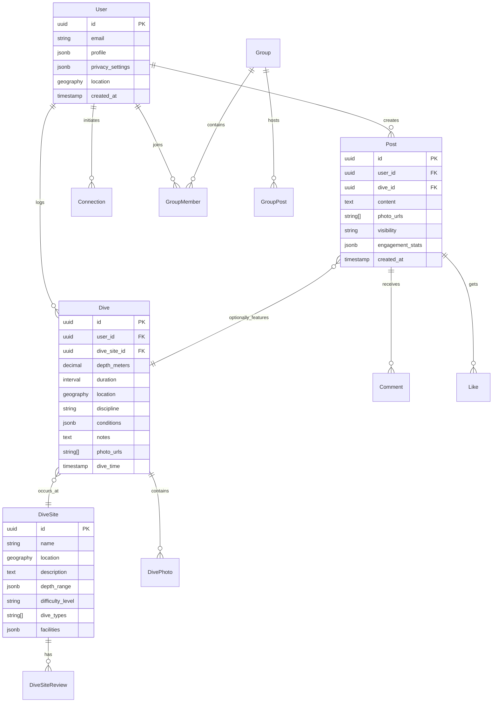

# Data Models

## Core Business Entities

Based on the PRD requirements, DiveTribe's data model centers around diving activities, social interactions, and community building:

### User

- **Purpose:** Central entity representing divers with profiles, preferences, and authentication
- **Key Attributes:** id, email, profile (name, bio, certifications, gear), privacy_settings, location, diving_goals
- **Relationships:** one-to-many with Dives, Posts, Connections; many-to-many with Groups

### Dive

- **Purpose:** Core activity tracking entity storing dive performance and metadata
- **Key Attributes:** id, user_id, depth, duration, location (GPS), dive_site, discipline, temperature, visibility, equipment, notes, photos, created_at
- **Relationships:** belongs to User, belongs to DiveSite, has many DivePhotos
- **Data Types:** depth (decimal), duration (interval), location (geography), photos (array)

### DiveSite

- **Purpose:** Shared database of diving locations with community-contributed information
- **Key Attributes:** id, name, location (GPS), description, depth_range, difficulty_level, dive_type, conditions, facilities
- **Relationships:** has many Dives, has many DiveSiteReviews

### Post

- **Purpose:** Social feed content combining dive data with photos and commentary
- **Key Attributes:** id, user_id, dive_id (optional), content, photos, visibility, created_at, engagement_stats
- **Relationships:** belongs to User, optionally belongs to Dive, has many Comments and Likes

### Connection

- **Purpose:** Relationship management between users (buddies, instructors, followers)
- **Key Attributes:** id, requester_id, addressee_id, connection_type, status, created_at
- **Relationships:** belongs to two Users
- **Types:** buddy, instructor_student, follower

### Group

- **Purpose:** Local diving communities and interest-based organizations
- **Key Attributes:** id, name, description, location, group_type, privacy_level, member_count
- **Relationships:** has many GroupMembers, belongs to creator User

## Database Relationships

