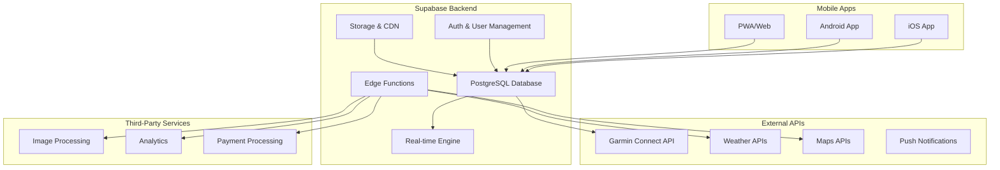

# High Level Architecture

## System Overview

DiveTribe follows a **mobile-first serverless architecture** with Supabase as the backend-as-a-service platform and React Native (Expo) for cross-platform mobile development.

## Architectural and Design Patterns

- **Backend-as-a-Service (BaaS):** Supabase provides managed PostgreSQL, authentication, real-time subscriptions, and storage - _Rationale:_ Reduces infrastructure complexity and enables rapid MVP development while maintaining scalability
- **Mobile-First Progressive Web App:** React Native with Expo Router for native performance and web compatibility - _Rationale:_ Maximizes reach with single codebase while optimizing for mobile experience
- **Event-Driven Real-time Architecture:** Supabase real-time subscriptions for live feed updates and notifications - _Rationale:_ Essential for social features and real-time dive tracking
- **Repository Pattern:** Abstract data access through typed services - _Rationale:_ Enables testing, caching strategies, and potential future database migrations
- **Component-Based UI Architecture:** Reusable components with design system - _Rationale:_ Ensures consistency across screens and accelerates development
