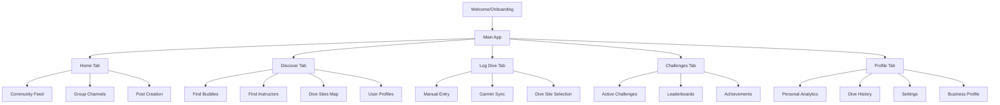
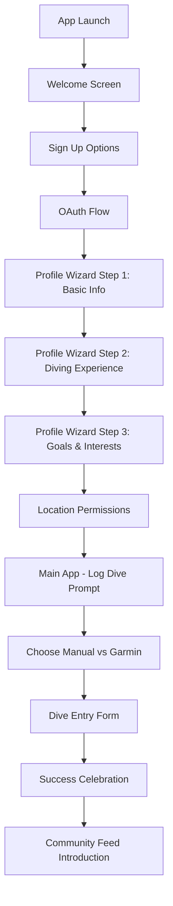
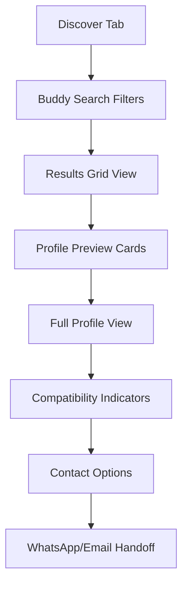
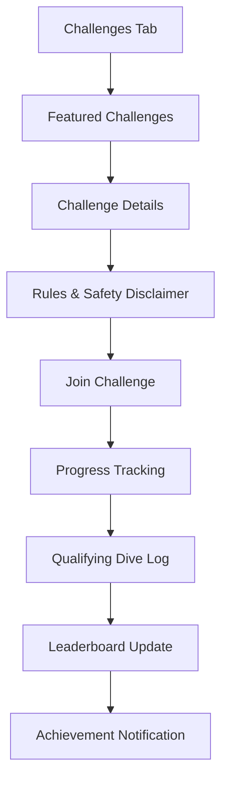

# DiveTribe UI/UX Specification

This document defines the user experience goals, information architecture, user flows, and visual design specifications for DiveTribe's user interface. It serves as the foundation for visual design and frontend development, ensuring a cohesive and user-centered experience.

## Overall UX Goals & Principles

### Target User Personas

**Performance-Focused Freediver:** Technical athletes who track depth, time, and progression metrics. They want detailed analytics, goal setting, and performance comparison features similar to Strava's power users.

**Social Community Diver:** Recreational divers who prioritize connection, shared experiences, and discovering new dive sites. They value photo sharing, group activities, and finding local dive buddies for safety and companionship.

**Learning-Oriented Beginner:** New divers seeking instruction, mentorship, and safe diving practices. They need clear guidance, instructor discovery, and educational content integrated naturally into their journey.

**Diving Professional:** Instructors, guides, and shop owners who want to showcase services, connect with students, and build their professional reputation through quality content and verified credentials.

### Usability Goals

**Immediate Value Recognition:** New users understand DiveTribe's unique value within 30 seconds of opening the app - it's the performance + community platform for serious ocean athletes.

**Effortless Dive Logging:** Completing a dive log (manual or Garmin sync) takes less than 60 seconds, with smart defaults and progressive disclosure of optional details.

**Confident Buddy Discovery:** Users can find and evaluate potential dive partners within 2-3 interactions, with clear safety indicators and compatibility signals.

**Engaging Community Participation:** Social interactions feel natural and diving-specific, encouraging meaningful connections rather than superficial engagement.

**Professional Service Discovery:** Finding qualified instructors or services feels trustworthy and efficient, with clear credentialing and authentic reviews.

### Design Principles

1. **Ocean-First Aesthetics** - Every design decision should evoke the precision, beauty, and respect inherent in freediving culture
2. **Performance + Heart** - Balance data-driven features with warm community connection - think "athletic Strava meets caring dive family"
3. **Safety-Conscious Design** - Prioritize features and flows that promote safe diving practices and responsible buddy systems
4. **Mobile-Native Excellence** - Design specifically for post-dive logging with potentially wet hands and bright sunlight conditions
5. **Progressive Expertise** - Interface adapts complexity based on user experience level, from beginner-friendly to expert-detailed

### Change Log

| Date       | Version | Description                          | Author    |
| ---------- | ------- | ------------------------------------ | --------- |
| 2024-12-19 | 1.0     | Initial UI/UX specification creation | UX Expert |

## Information Architecture (IA)

### Site Map / Screen Inventory

### Navigation Structure

**Primary Navigation:** Bottom tab bar with 5 core sections - Home (community), Discover (people/places), Log Dive (central action), Challenges (motivation), Profile (personal)

**Secondary Navigation:** Within-tab navigation using header segments, modal sheets for creation flows, and contextual action sheets for quick operations

**Breadcrumb Strategy:** Minimal breadcrumbs due to mobile constraints - rely on clear tab states, modal dismissal patterns, and contextual back navigation

## User Flows

### Flow 1: New User Onboarding & First Dive Log

**User Goal:** Complete account setup and log first dive to understand DiveTribe's value proposition

**Entry Points:** App store download, friend referral, social media discovery

**Success Criteria:** User completes profile setup and successfully logs first dive within 10 minutes

#### Flow Diagram

#### Edge Cases & Error Handling:

- OAuth failures redirect to email signup with clear error messaging
- Location permission denial shows alternative manual location entry
- Incomplete profile wizard allows continuation later with visible progress indicator
- Network failures during dive logging save draft locally with sync indicators

#### Notes:

Onboarding emphasizes DiveTribe's unique position - not just another social app, but the performance platform for serious divers. Quick wins through immediate dive logging show tangible value.

### Flow 2: Discovery & Buddy Connection

**User Goal:** Find compatible local dive buddy for weekend diving

**Entry Points:** Discover tab, post-dive sharing, group member browsing

**Success Criteria:** User identifies potential buddy and initiates contact within 5 interactions

#### Flow Diagram

#### Edge Cases & Error Handling:

- No local results show expanded radius suggestions and travel-willing users
- Contact method failures provide alternative options (in-app message, profile sharing)
- Privacy settings respected throughout discovery flow
- Safety warnings for meeting new dive partners in person

#### Notes:

Discovery flow balances comprehensive filtering with quick browsing. Compatibility signals help users make confident connection decisions while maintaining safety awareness.

### Flow 3: Challenge Participation & Achievement

**User Goal:** Join monthly depth challenge and track progress toward personal best

**Entry Points:** Challenges tab, community feed challenge posts, push notifications

**Success Criteria:** User joins challenge, understands rules, and logs qualifying dive

#### Flow Diagram

#### Edge Cases & Error Handling:

- Challenge eligibility requirements clearly stated upfront
- Safety disclaimers require acknowledgment before participation
- Progress disputes handled through community reporting system
- Late challenge entries handled gracefully with clear cutoff communication

#### Notes:

Gamification features maintain strong safety messaging while encouraging healthy competition. Achievement celebrations feel meaningful and shareable.

## Wireframes & Mockups

### Design Files

**Primary Design Files:** To be created in Figma with comprehensive component library and responsive breakpoints

### Key Screen Layouts

#### Welcome & Onboarding Screens

**Purpose:** Introduce DiveTribe's unique value and capture essential user information

**Key Elements:**

- Hero video/animation showing underwater footage with data overlay
- Clear value proposition: "The performance platform for freedivers"
- Three-step social proof: tracking, community, achievement
- Minimal friction signup with OAuth prominence

**Interaction Notes:** Smooth transitions between onboarding steps with progress indicators. Skip options for non-essential information.

**Design File Reference:** welcome-flow.fig

#### Community Feed (Home Tab)

**Purpose:** Central social hub showcasing dive stories with performance metrics

**Key Elements:**

- Infinite scroll card-based layout optimized for dive content
- Post cards featuring: profile photo, dive metrics summary, location, main photo, caption
- Floating action button for quick dive post creation
- Story-style highlights for groups and featured content
- Pull-to-refresh with ocean wave animation

**Interaction Notes:** Smooth scroll performance essential for engagement. Metric overlays on photos should be legible in bright sunlight. Quick engagement actions (like, comment) easily accessible.

**Design File Reference:** community-feed.fig

#### Dive Logging Interface

**Purpose:** Streamlined dive entry optimized for post-dive conditions

**Key Elements:**

- Large, touch-friendly input fields for wet hands operation
- Smart defaults based on location and previous dives
- Progressive disclosure - essential fields first, details expandable
- Visual dive site selector with map integration
- Real-time Garmin sync status and data preview

**Interaction Notes:** Form validation provides helpful guidance without blocking progress. Auto-save prevents data loss. Success state celebrates achievement with personal milestone context.

**Design File Reference:** dive-logging.fig

#### Discovery & Matching Interface

**Purpose:** Efficient buddy and instructor discovery with trust indicators

**Key Elements:**

- Filter sidebar with priority controls (distance, experience, safety certs)
- Grid layout for quick browsing with key compatibility indicators
- Profile cards showing mutual connections and verification badges
- Map view toggle for geographic discovery
- Contact methods clearly presented with privacy respect

**Interaction Notes:** Filtering provides immediate visual feedback. Profile cards balance comprehensive info with quick scanning. Safety indicators prominent throughout.

**Design File Reference:** discovery-matching.fig

## Component Library / Design System

### Design System Approach

**DiveTribe Design System:** Custom system built on performance and ocean aesthetics, ensuring consistency across all touchpoints while maintaining the premium feel expected by serious divers.

### Core Components

#### DiveCard Component

**Purpose:** Primary content display for dive posts and personal dive history

**Variants:**

- Feed Card (social context with engagement actions)
- History Card (personal analytics focus)
- Comparison Card (side-by-side performance)
- Challenge Card (gamification context)

**States:** Loading, populated, error, offline cached

**Usage Guidelines:** Always include essential safety context (buddy info, conditions). Metrics should be immediately scannable. Photos optimized for mobile viewing.

#### UserProfile Component

**Purpose:** Standardized user representation across discovery, social, and business contexts

**Variants:**

- Compact Card (discovery grid)
- Detailed Profile (full screen)
- Business Profile (enhanced with service info)
- Verification Badge (trust indicators)

**States:** Public, friends-only, business verified, offline user

**Usage Guidelines:** Verification badges always visible when applicable. Contact methods respect user privacy settings. Compatibility indicators help decision-making.

#### NavigationTab Component

**Purpose:** Primary app navigation with activity indicators and quick actions

**Variants:**

- Standard Tab (icon + label)
- Active Tab (highlighted state)
- Notification Badge (unread activity)
- Quick Action (floating creation button)

**States:** Default, active, disabled, badge notification

**Usage Guidelines:** Icons universally recognizable. Labels clear and diving-specific. Notification badges respect user preferences.

#### MetricDisplay Component

**Purpose:** Consistent presentation of dive performance data

**Variants:**

- Headline Metric (primary achievement)
- Comparison Metric (progress tracking)
- Historical Trend (analytics view)
- Challenge Progress (gamification)

**States:** Personal best, improvement, decline, no data

**Usage Guidelines:** Units always visible. Trends clearly indicated with color and iconography. Context provided for meaningfulness.

## Branding & Style Guide

### Visual Identity

**Brand Guidelines:** Ocean-athlete aesthetic balancing precision instrumentation with natural beauty and community warmth

### Color Palette

| Color Type       | Hex Code | Usage                                   |
| ---------------- | -------- | --------------------------------------- |
| Deep Ocean       | #0B1426  | Primary backgrounds, navigation         |
| Dive Blue        | #1E3A8A  | Primary actions, links, highlights      |
| Aqua Active      | #06B6D4  | Success states, achievements, metrics   |
| Surface Light    | #F8FAFC  | Content backgrounds, cards              |
| Depth Gradient   | #334155  | Secondary text, borders                 |
| Safety Orange    | #EA580C  | Warnings, safety alerts, urgent actions |
| Achievement Gold | #F59E0B  | Badges, premium features, celebrations  |
| Community Green  | #059669  | Social actions, community features      |

### Typography

#### Font Families

- **Primary:** Inter (clean, readable, modern sans-serif optimized for mobile)
- **Secondary:** Source Code Pro (monospace for precise metrics and data)
- **Accent:** Inter Display (bold weights for headlines and celebrations)

#### Type Scale

| Element | Size | Weight | Line Height |
| ------- | ---- | ------ | ----------- |
| H1      | 32px | 700    | 1.2         |
| H2      | 24px | 600    | 1.3         |
| H3      | 20px | 600    | 1.4         |
| Body    | 16px | 400    | 1.5         |
| Small   | 14px | 400    | 1.4         |
| Caption | 12px | 500    | 1.3         |
| Metrics | 18px | 600    | 1.2         |

### Iconography

**Icon Library:** Custom icon set based on diving equipment and ocean elements combined with universal interface symbols

**Usage Guidelines:** Icons should be immediately recognizable to diving community while remaining accessible to newcomers. Consistent stroke width and style throughout.

### Spacing & Layout

**Grid System:** 8px base unit system with 16px and 24px primary spacing increments

**Spacing Scale:** 4px, 8px, 12px, 16px, 24px, 32px, 48px, 64px for consistent rhythm

## Accessibility Requirements

### Compliance Target

**Standard:** WCAG AA compliance with particular focus on mobile usability and outdoor viewing conditions

### Key Requirements

**Visual:**

- Color contrast ratios: 4.5:1 for normal text, 3:1 for large text and interface elements
- Focus indicators: 2px solid outline with 4.5:1 contrast against all backgrounds
- Text sizing: Support for 200% zoom without horizontal scrolling, minimum 44px touch targets

**Interaction:**

- Keyboard navigation: Full tab navigation support for connected keyboards
- Screen reader support: Semantic HTML structure, proper ARIA labels, descriptive alt text for dive photos
- Touch targets: Minimum 44px × 44px with adequate spacing for accurate selection

**Content:**

- Alternative text: Comprehensive descriptions for dive site photos, underwater imagery, and metric visualizations
- Heading structure: Logical H1-H6 hierarchy for screen reader navigation
- Form labels: Clear, descriptive labels for all dive logging and profile inputs

### Testing Strategy

**Accessibility testing:** Automated testing with axe-core integrated into development workflow, manual testing with VoiceOver (iOS) and TalkBack (Android), user testing with diving community members who use assistive technologies

## Responsiveness Strategy

### Breakpoints

| Breakpoint | Min Width | Max Width | Target Devices                           |
| ---------- | --------- | --------- | ---------------------------------------- |
| Mobile     | 320px     | 767px     | iPhone SE to Plus models, Android phones |
| Tablet     | 768px     | 1023px    | iPad, Android tablets                    |
| Desktop    | 1024px    | 1439px    | Laptop screens, desktop monitors         |
| Wide       | 1440px    | -         | Large desktop displays                   |

### Adaptation Patterns

**Layout Changes:** Mobile-first design with progressive enhancement for larger screens. Card layouts stack vertically on mobile, move to grid layouts on tablet+

**Navigation Changes:** Bottom tab navigation on mobile, horizontal header navigation on desktop with sidebar options for complex sections

**Content Priority:** Essential dive information always visible, secondary details expand on larger screens. Metric visualizations adapt from simple cards to comprehensive dashboards

**Interaction Changes:** Touch-optimized controls on mobile, hover states and keyboard shortcuts on desktop. Drag/swipe gestures on mobile, click/keyboard on desktop

## Animation & Micro-interactions

### Motion Principles

**Ocean-Inspired Movement:** Smooth, fluid animations that echo underwater motion - gentle easing curves, flowing transitions, and depth-aware layering

### Key Animations

- **Dive Depth Animation:** Metric counters that smoothly animate to final values with satisfying easing, mimicking the gradual pressure change during descent
- **Feed Refresh:** Wave-like pull-to-refresh animation that connects to ocean theme while providing clear loading feedback
- **Achievement Celebration:** Bubble-burst animation for milestone achievements with haptic feedback on iOS
- **Navigation Transitions:** Smooth slide and fade transitions between tabs with subtle depth shadows
- **Data Loading:** Shimmer effects for dive analytics with wave-like progression

## Performance Considerations

### Performance Goals

- **Page Load:** Initial app launch under 2 seconds on mid-range devices
- **Interaction Response:** UI feedback within 100ms for all touch interactions
- **Animation FPS:** Consistent 60fps for all animations and scrolling

### Design Strategies

**Image Optimization:** Automatic compression and sizing for dive photos, lazy loading for feed content, WebP format with JPEG fallbacks

**Component Efficiency:** Virtualized lists for large datasets (dive history, community feeds), component recycling for smooth scrolling

**Network Optimization:** Optimistic UI updates for social interactions, intelligent prefetching for likely user actions, graceful degradation for poor connections

## Next Steps

### Immediate Actions

1. **Create comprehensive Figma design system** with all defined components and tokens
2. **Design priority screens** starting with onboarding flow and core dive logging interface
3. **User testing plan** with target diving community members to validate assumptions
4. **Accessibility audit preparation** including screen reader testing protocols
5. **Developer handoff documentation** with component specifications and interaction details

### Design Handoff Checklist

- [ ] All user flows documented with edge cases and error states
- [ ] Component library complete with all variants and states
- [ ] Accessibility requirements defined with testing criteria
- [ ] Responsive behavior specified for all breakpoints
- [ ] Animation specifications with timing and easing details
- [ ] Performance requirements documented with measurement criteria
